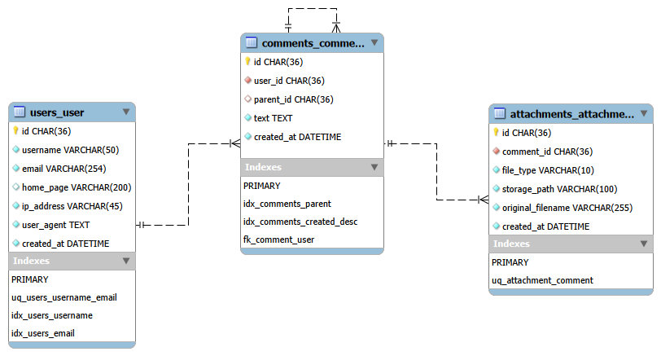

# 💬 SPA Comments

> A full-stack threaded comments application with real-time updates, async email notifications, Redis caching, and file attachments.


---

## ✨ Features

- **Threaded comments** — infinite nesting via self-referential FK; any comment can be replied to at any depth
- **Real-time updates** — new top-level comments appear instantly via WebSocket (Django Channels + Redis channel layer) without page reload
- **Async email notifications** — when a reply is posted, the parent author receives an email via a Celery task (retried up to 3× on failure)
- **Redis caching** — paginated list cached for 60 s, comment trees cached for 5 min; pattern-based invalidation on write
- **File attachments** — one file per comment; images (JPG/PNG/GIF) auto-resized to 320×240 px, text files capped at 100 KB
- **CAPTCHA** — server-generated image CAPTCHA required on every submission; token + answer validated server-side
- **JWT identity token** — signed token issued on comment creation; frontend pre-fills the form on the next visit
- **XSS-safe HTML** — comment text sanitized with `bleach`; only `<a>`, `<code>`, `<i>`, `<strong>` are allowed
- **Sorting & pagination** — list sortable by `username`, `email`, `created_at` (asc/desc); 25 comments per page
- **Layered architecture** — View → Service → Repository separation; clean dependency injection throughout

---

## 🏗 Architecture

### Request flow

```
Browser
  │
  ├─ HTTP  →  nginx :8080
  │             ├─ /api/*       →  Django (daphne) :8000  →  PostgreSQL
  │             ├─ /ws/*        →  Django Channels  :8000  →  Redis (channels DB 2)
  │             ├─ /static/*    →  staticfiles volume
  │             ├─ /media/*     →  media bind-mount
  │             └─ /*           →  Vue SPA (index.html)
  │
  └─ WS   →  nginx :8080  →  daphne  →  CommentConsumer
                                           └─ Redis channel layer
                                                └─ broadcasts to all connected clients
```

### Write path (POST /api/comments/)

```
View (CommentViewSet.create)
  └─ CommentService.create_comment()
        1. CaptchaService.validate()         — verify token + answer
        2. sanitize_comment_text()           — bleach strip disallowed tags
        3. CommentRepository.get_by_id()     — validate parent exists
        4. UserRepository.get_or_create()    — resolve commenter identity
        5. CommentRepository.create()        — INSERT comment row
        6. invalidate_list_cache() / invalidate_tree_cache()
        7. transaction.on_commit(comment_created.send)
              ├─ WebSocket handler  →  channel_layer.group_send  →  all clients
              └─ Celery task        →  notify_reply_author()  →  email
        8. issue_identity_token()            — return JWT to frontend
```

### Design decisions

- **`transaction.on_commit`** fires the signal only after the DB transaction commits — prevents WebSocket clients from receiving an event for a row that was subsequently rolled back
- **Recursive CTE** replaces the ORM for tree fetches — one query at any depth instead of N+1 per level
- **Three separate Redis logical DBs** (1 = cache, 2 = channels, 3 = Celery) — isolated so a Celery queue flush never evicts comment cache entries
- **Repository layer** keeps raw SQL contained; the service layer never touches `connection.cursor()` directly

---

## 🛠 Tech Stack

| Layer           | Technology                                       |
|-----------------|--------------------------------------------------|
| **Backend**     | Python 3.12, Django 6, Django REST Framework     |
| **ASGI server** | Daphne                                           |
| **WebSocket**   | Django Channels 4 + channels-redis               |
| **Task queue**  | Celery 5 + Redis broker                          |
| **Database**    | PostgreSQL 16                                    |
| **Cache**       | Redis 7 (django-redis)                           |
| **Auth**        | djangorestframework-simplejwt (identity token)   |
| **Frontend**    | Vue 3 (Composition API), Axios, Vite             |
| **Proxy**       | nginx (static files, reverse proxy, WS upgrade)  |
| **Container**   | Docker, Docker Compose                           |
| **CI**          | GitHub Actions (ruff, mypy, pytest)              |
| **CD**          | GitHub Actions → GHCR → VPS via Docker Compose  |
| **Testing**     | pytest-django, factory-boy, pytest-cov           |
| **Linting**     | Ruff, mypy                                       |

---

## 📁 Project Structure

```
spa/
├── backend/
│   ├── apps/
│   │   ├── attachments/        # File upload: strategy pattern, Pillow processing
│   │   ├── captcha_app/        # CAPTCHA generation and validation
│   │   ├── comments/           # Core domain: models, views, service, repository, signals
│   │   ├── notifications/      # Celery tasks, email templates
│   │   └── users/              # Commenter identity model, JWT issuance
│   ├── config/
│   │   ├── settings/
│   │   │   ├── base.py         # Shared settings
│   │   │   ├── development.py  # DEBUG, dev email backend
│   │   │   └── production.py   # Console email backend, CORS
│   │   ├── asgi.py             # ASGI entrypoint (HTTP + WebSocket routing)
│   │   ├── celery_app.py       # Celery application
│   │   └── urls.py             # Root URL configuration
│   ├── core/
│   │   ├── cache.py            # Cache key builders and invalidation helpers
│   │   ├── exceptions.py       # Domain exception types
│   │   ├── pagination.py       # CommentPagination (25/page)
│   │   └── validators.py       # bleach-based text sanitizer
│   ├── websocket/
│   │   ├── consumers.py        # AsyncWebsocketConsumer (read-only push)
│   │   └── routing.py          # WebSocket URL patterns
│   ├── tests/
│   │   ├── unit/               # Service, serializer, cache, signal unit tests
│   │   └── integration/        # API, repository, WebSocket consumer tests (real DB)
│   ├── Dockerfile
│   └── pyproject.toml
├── frontend/
│   ├── src/
│   │   ├── api/client.js       # Axios client (baseURL: /api)
│   │   ├── composables/
│   │   │   └── useWebSocket.js # WS connection, auto-cleanup on unmount
│   │   ├── components/         # CommentForm, CommentList, CommentItem, CommentTree
│   │   └── App.vue             # Root component, comment loading, WS wiring
│   ├── Dockerfile              # Multi-stage build: Node → Alpine dist copy
│   └── vite.config.js          # Dev proxy: /api and /ws → localhost:8000
├── nginx/
│   └── nginx.conf              # Routes /api/ to Django, /* to Vue SPA
├── docker-compose.yml          # Development stack
├── docker-compose.prod.yml     # Production stack with resource limits
├── Makefile                    # Common dev/ops shortcuts
└── .env.example                # Template for required environment variables
```

---

## 🚀 Quick Start (Docker)

```bash
# 1. Clone and enter the project
git clone <repo-url> && cd spa

# 2. Copy environment files
cp .env.example .env
cp .env.example .env.prod

# 3. Start the full production stack
make up-prod
```

Open **http://localhost:8080** — the Vue app loads, API and WebSocket are live.

> To stop: `docker compose -f docker-compose.prod.yml down`

---

## 💻 Local Development

Run backend and frontend separately without Docker for a faster feedback loop.

### Prerequisites

- Python 3.12, [Poetry](https://python-poetry.org/) 2.x
- Node.js 20+
- PostgreSQL 16 and Redis 7 running locally (or via `docker compose up db redis`)

### Backend

```bash
cd backend

# Install dependencies
poetry install

# Apply migrations
poetry run python manage.py migrate

# Start ASGI server
DJANGO_SETTINGS_MODULE=config.settings.development \
  poetry run daphne -b 0.0.0.0 -p 8000 config.asgi:application

# Start Celery worker (separate terminal)
poetry run celery -A config.celery_app worker --loglevel=info
```

### Frontend

```bash
cd frontend
npm install
npm run dev         # http://localhost:5173 — proxies /api and /ws to :8000
```

### Code quality

```bash
make ruff           # lint
make ruff-format    # format check
make mypy           # type check
make test           # pytest with coverage
```

---

## ⚙️ Environment Variables

Both `.env` (dev) and `.env.prod` (production stack) use the same keys.

| Variable               | Description                                     | Example                    |
|------------------------|-------------------------------------------------|----------------------------|
| `SECRET_KEY`           | Django secret key                               | `your-secret-key-here`     |
| `DEBUG`                | Django debug mode                               | `True` / `False`           |
| `ALLOWED_HOSTS`        | Comma-separated allowed hostnames               | `localhost,127.0.0.1`      |
| `POSTGRES_DB`          | PostgreSQL database name                        | `comments_db`              |
| `POSTGRES_USER`        | PostgreSQL user                                 | `comments_user`            |
| `POSTGRES_PASSWORD`    | PostgreSQL password                             | `comments_password`        |
| `POSTGRES_HOST`        | PostgreSQL host (`db` inside Docker)            | `localhost`                |
| `POSTGRES_PORT`        | PostgreSQL port                                 | `5432`                     |
| `REDIS_CACHE_URL`      | Redis URL for Django cache                      | `redis://localhost:6379/1` |
| `REDIS_CHANNELS_URL`   | Redis URL for Django Channels layer             | `redis://localhost:6379/2` |
| `REDIS_CELERY_URL`     | Redis URL for Celery broker + backend           | `redis://localhost:6379/3` |
| `CORS_ALLOWED_ORIGINS` | Comma-separated allowed CORS origins            | `http://localhost:5173`    |
| `EMAIL_HOST`           | SMTP host (unused when console backend active)  | `smtp.gmail.com`           |
| `EMAIL_PORT`           | SMTP port                                       | `587`                      |
| `EMAIL_USE_TLS`        | Enable STARTTLS                                 | `true`                     |
| `EMAIL_HOST_USER`      | SMTP login                                      | `you@gmail.com`            |
| `EMAIL_HOST_PASSWORD`  | SMTP password or app password                   | `your-app-password`        |
| `DEFAULT_FROM_EMAIL`   | From address for outgoing emails                | `noreply@yoursite.com`     |

> **Note:** `production.py` currently uses `console.EmailBackend` — emails print to stdout instead of sending. To enable real SMTP, uncomment the `EMAIL_*` lines in `production.py` and fill in the variables above.

---

## 🔌 API Reference

Base URL: `/api/`

| Method | Path                       | Description                                                                           |
|--------|----------------------------|---------------------------------------------------------------------------------------|
| `GET`  | `/api/`                    | API root — lists available endpoints                                                  |
| `GET`  | `/api/comments/`           | Paginated top-level comment list. Query params: `ordering`, `page`, `username`, `email` |
| `POST` | `/api/comments/`           | Create a new comment or reply. Accepts `multipart/form-data` for file attachment      |
| `GET`  | `/api/comments/{id}/tree/` | Full nested reply tree for a single comment (recursive CTE, cached 5 min)            |
| `GET`  | `/api/captcha/`            | Generate a new CAPTCHA — returns `{ token, image }` (base64 PNG)                     |

### POST `/api/comments/` — request fields

| Field            | Type   | Required | Description                                              |
|------------------|--------|----------|----------------------------------------------------------|
| `username`       | string | ✅       | Letters and digits only (`[a-zA-Z0-9]+`)                 |
| `email`          | string | ✅       | Valid email address                                      |
| `text`           | string | ✅       | Comment body. Allowed HTML: `<a>` `<code>` `<i>` `<strong>` |
| `captcha_token`  | string | ✅       | Token from `GET /api/captcha/`                           |
| `captcha_answer` | string | ✅       | User's answer to the CAPTCHA                             |
| `home_page`      | string | ❌       | Optional URL                                             |
| `parent_id`      | UUID   | ❌       | ID of the comment being replied to                       |
| `file`           | file   | ❌       | JPG/PNG/GIF (≤ 320×240 px) or TXT (≤ 100 KB)           |

### POST `/api/comments/` — response (201)

```json
{
  "id": "uuid",
  "created_at": "2025-01-01T12:00:00Z",
  "token": "<jwt-identity-token>"
}
```

### WebSocket

Connect to `ws://<host>/ws/comments/` (or `wss://` over HTTPS) to receive real-time events. The channel is **server-push only** — clients connect and listen, sending is ignored. The frontend automatically selects the correct scheme based on `window.location.protocol`.

**Event payload:**
```json
{
  "id": "uuid",
  "username": "alice",
  "text": "Hello!",
  "created_at": "2025-01-01T12:00:00Z",
  "parent_id": null
}
```

---

## 🧪 Running Tests

```bash
cd backend

# Full suite with coverage report
make test

# Or directly
poetry run pytest tests/ -v --cov=. --cov-report=term-missing

# Unit tests only (no DB needed)
poetry run pytest tests/unit/ -v

# Integration tests only (requires PostgreSQL + Redis)
poetry run pytest tests/integration/ -v
```

### Test layout

```
tests/
├── unit/
│   ├── test_comment_service.py      # CommentService with mocked deps
│   ├── test_build_tree.py           # _build_tree() pure logic
│   ├── test_cache.py                # Cache key builders
│   ├── test_captcha_service.py
│   ├── test_attachment_service.py
│   ├── test_attachment_serializer.py
│   ├── test_handlers.py             # Signal → WebSocket handler
│   └── test_email.py
└── integration/
    ├── test_comments_api.py         # Full HTTP round-trips (real DB)
    ├── test_comment_repository.py   # Repository against real PostgreSQL
    ├── test_user_repository.py
    ├── test_captcha_api.py
    └── test_ws_consumer.py          # WebSocket consumer (channels test layer)
```

> Integration tests use a real PostgreSQL database — no ORM mocking. The CI job spins up `postgres:16-alpine` and `redis:7-alpine` as service containers.

---

## 🚢 CD — Continuous Deployment

Defined in [.github/workflows/cd.yml](.github/workflows/cd.yml). Triggers on every push to `main` or `develop`.

### Flow

```
git push → GitHub Actions runner
               ├── docker build ./backend  → ghcr.io/dkibalenko/spa-backend:latest
               │                          → ghcr.io/dkibalenko/spa-backend:<git-sha>
               └── docker build ./frontend → ghcr.io/dkibalenko/spa-frontend:latest
                                           → ghcr.io/dkibalenko/spa-frontend:<git-sha>

VPS (manual or automated):
  docker compose -f docker-compose.prod.yml pull
  docker compose -f docker-compose.prod.yml up -d --remove-orphans
```

### Image tagging

Each build pushes two tags per image:

| Tag | Purpose |
|-----|---------|
| `:latest` | always points to the newest build — what the VPS pulls by default |
| `:<git-sha>` | permanent, immutable reference to a specific commit |

The SHA tag enables rollback without touching code — just pin the image in `docker-compose.prod.yml` to any previous SHA visible in GitHub Packages and re-run `docker compose up`.

### Frontend build

The Vue build (`npm run build`) runs **inside the Docker image** via the multi-stage `frontend/Dockerfile`. There is no separate Node.js build step in CI — building the image *is* building the frontend. On startup the container copies the built `/dist` into the `frontend_dist` named volume, which nginx serves.

### Required GitHub repository secrets

| Secret | Description |
|--------|-------------|
| `VPS_HOST` | VPS IP address or hostname |
| `VPS_USER` | SSH user on the VPS |
| `VPS_SSH_KEY` | Private SSH key for VPS access |
| `GHCR_TOKEN` | GitHub PAT with `read:packages` scope — used by the VPS to pull images |

`GITHUB_TOKEN` (used to **push** images from the Actions runner) is auto-generated by GitHub per run — no setup needed.

### VPS prerequisites

The VPS needs `docker-compose.prod.yml` and `.env.prod` in place before the first deploy. After that, every deploy is:

```bash
cd ~/app
docker compose -f docker-compose.prod.yml pull
docker compose -f docker-compose.prod.yml up -d --remove-orphans
docker image prune -f   # optional: clean up untagged old images
```

---

## 🗄 Database Schema

Three tables; all primary keys are UUIDs. CAPTCHA tokens are stored in Redis (TTL 300 s) — no DB table.



> Schema files: [`docs/db_schema.sql`](docs/db_schema.sql) · [`docs/db_schema.mwb`](docs/db_schema.mwb) (MySQL Workbench)

```
users_user
  id            UUID  PK
  username      VARCHAR(50)
  email         VARCHAR
  home_page     VARCHAR  nullable
  ip_address    INET
  user_agent    TEXT
  created_at    TIMESTAMPTZ
  UNIQUE (username, email)

comments_comment
  id            UUID  PK
  user_id       UUID  FK → users_user
  parent_id     UUID  FK → comments_comment  nullable  (self-referential)
  text          TEXT
  created_at    TIMESTAMPTZ
  INDEX (parent_id)
  INDEX (created_at DESC)

attachments_attachment
  id                UUID  PK
  comment_id        UUID  FK → comments_comment  UNIQUE (one per comment)
  file_type         VARCHAR(10)  choices: image | text
  storage_path      VARCHAR(100)
  original_filename VARCHAR(255)
  created_at        TIMESTAMPTZ
```

**Indexes:**
- `idx_comments_parent` — speeds up loading replies for a given parent
- `idx_comments_created_desc` — default ordering and list query
- `idx_users_email`, `idx_users_username` — identity lookups on `get_or_create`

---

## 📋 Implementation Notes

Key engineering decisions made during the design and implementation of this project.

### Architecture Decisions

**Recursive CTE instead of ORM for tree fetches**
The ORM cannot express recursive queries without either N+1 per level or unbounded prefetch depth. A single `WITH RECURSIVE` query fetches the entire thread in one round-trip at arbitrary depth. Depth is guarded at 50 levels to protect against pathological data.

**Repository → Service → View layering**
Views handle only HTTP concerns (request parsing, status codes). Services own business logic and orchestration. Repositories own all database access. This makes the service layer testable with mocked repositories and keeps raw SQL in one place (`CommentRepository.get_tree`).

**`transaction.on_commit` for signal dispatch**
The `comment_created` signal fires the WebSocket broadcast and queues the Celery email task. Wrapping this in `on_commit` means neither side effect runs if the surrounding transaction rolls back — for example, after an attachment upload failure that triggers `comment.delete()`.

**Three isolated Redis logical databases**
Cache (DB 1), Channels (DB 2), and Celery (DB 3) are on separate logical databases. A `FLUSHDB` during debugging or a Celery `purge` cannot accidentally evict comment cache entries or drop pending channel messages.

**Strategy pattern for file processing**
`AttachmentService` selects an `ImageProcessor` or `TextProcessor` at runtime based on MIME type. Adding a new file type requires only a new processor class — the service and upload view are untouched.

**User identity without authentication**
There is no login. A `User` record is `get_or_create`d on `(username, email)`. The same person reusing the same credentials gets the same row, and the JWT lets the frontend pre-fill the form on the next visit. The token carries no session and grants no permissions.
